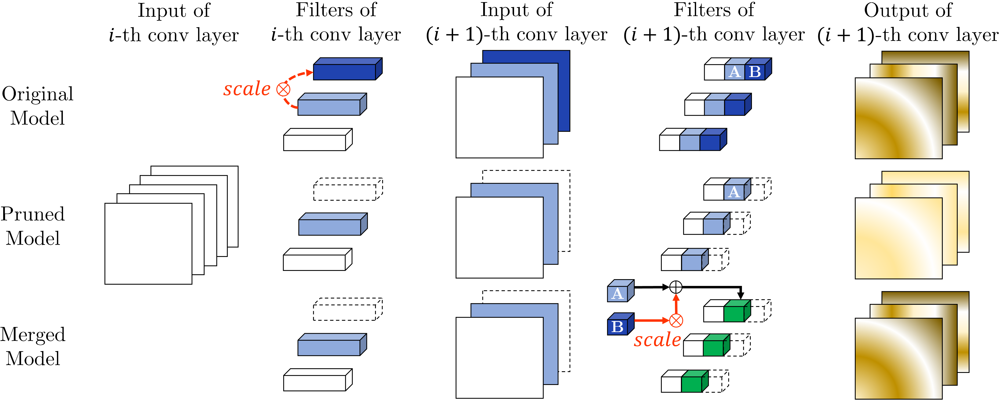

# COMP6248 Reproducability Challenge - Team 2
This repository contains the original code of the authors and our reimplementations/extensions. We have chosen a paper by Kim et al. submitted to the 2020 NeurIPS conference with the title **Neuron Merging: Compensating for Pruned Neurons**. The paper can be accessed at https://papers.nips.cc/paper/2020/hash/0678ca2eae02d542cc931e81b74de122-Abstract.html.

## Team members
- Bence Cserkuti (bc1u17@soton.ac.uk)
- Olaf Lipinski (o.lipinski@soton.ac.uk)
- Matthew Pugh (mp8g16@soton.ac.uk)
- Kian Spencer (k.spencer@soton.ac.uk)

## Our contributions
#### 1. Model agnostic implementation (on branch `main`)

`/reimplement/nmerge.py` is an attempt to create a model agnostic implementation for neuron merging. To implement the original code to a new model, its exact architecture must be known and the user has to understand how to desctructure the weights before the merging algorithm can be called. This makes it quite difficult to use the merging algorithm on new models which limits its reproducability. The `nmerge.py` function accepts any model based on `torch.nn.Module` and attempts to determine which layers can be pruned (Conv2D followed by ReLU, Linear followed by ReLU).

#### 2. Addition of AlexNet (on branch `reprod-algo`)

We implemented and tested the merging algorithm on two versions of AlexNet: one trained on the CIFAR100 dataset and one on the ImageNet dataset. We wrote supporting scripts to train/download these models which are `scripts/create_AlexNet_CIFAR100.py` and `scripts/create_AlexNet_ImageNet.py`. The models are defined in `models/Alexnet_CIFAR100.py` and `models/Alexnet_ImageNet.py`. We modified `decompose.py` and `decompose_re.py` to support the AlexNet architecture. Finally, we wrote two scripts `scripts/AlexNet_CIFAR100.sh` and `scripts/AlexNet_ImageNet.sh` which follow the conventions of the original code, therefore AlexNet can be tested in the same way as the original models (e.g. VGG16). We added these modifications to the original README.md, so that other people can reproduce our results.

#### 3. Re-implementing algorithms 1-3 (on branch `reprod-algo`)

`decompose_re.py` contains the re-implementations of algorithms 1-3 as described in the paper. The file builds on the class `Decompose` from the original `decompose.py`. The re-implemented functions are `alg1_FC` and `alg2` for fully-connected layers and `alg1_conv` and `alg3` for convolutional layers. In terms of output the first pair of functions maps to `create_scaling_mat_ip_thres_bias` and the second pair maps to `create_scaling_mat_conv_thres_bn` of `decompose.py`. The variable names of the re-implemented functions match those used in the paper.

#### 4. Adding an implementation argument to the scripts (on branch `reprod-algo`)

We added a new argument -i for all of the models which enables the user to select between the original code ('original') and our re-implementation ('reimplementation'). By default this argument is 'original'. We modified the original README to add these changes so that they are reproducible.

# Original README: Neuron Merging: Compensating for Pruned Neurons

Pytorch implementation of  **Neuron Merging: Compensating for Pruned Neurons**, accepted at 34th Conference on Neural Information Processing Systems (NeurIPS 2020).    





## Requirements

To install requirements:

```setup
conda env create -f ./environment.yml
```

Python environment & main libraries:

* python 3.8
* pytorch 1.5.0
* scikit-learn 0.22.1
* torchvision 0.6.0


## LeNet-300-100

To test LeNet-300-100 model on FashionMNIST, run:

```eval
bash scripts/LeNet_300_100_FashionMNIST.sh -t [model type] -c [criterion] -r [pruning ratio]
```

You can use three arguments for this script:

- model type: original | prune | merge
- pruning criterion : l1-norm | l2-norm | l2-GM
- pruning ratio : 0.0 ~ 1.0


For example, to test the model after pruning 50% of the neurons with $l_1$-norm criterion, run: 

```
bash scripts/LeNet_300_100_FashionMNIST.sh -t prune -c l1-norm -r 0.5
```

To test the model after merging , run: 

```
bash scripts/LeNet_300_100_FashionMNIST.sh -t merge -c l1-norm -r 0.5
```


## VGG-16

To test VGG-16 model on CIFAR-10, run:

```eval
bash scripts/VGG16_CIFAR10.sh -t [model type] -c [criterion]
```

You can use two arguments for this script

- model type: original | prune | merge
- pruning criterion: l1-norm | l2-norm | l2-GM


As a pretrained model on CIFAR-100 is not included, you must train it first. To train VGG-16 on CIFAR-100, run:

```eval
bash scripts/VGG16_CIFAR100_train.sh
```

All the hyperparameters are as described in the supplementary material.


After training, to test VGG-16 model on CIFAR-100, run:

```eval
bash scripts/VGG16_CIFAR100.sh -t [model type] -c [criterion]
```

You can use two arguments for this script

- model type: original | prune | merge
- pruning criterion: l1-norm | l2-norm | l2-GM


## ResNet

To test ResNet-56 model on CIFAR-10, run:

```eval
bash scripts/ResNet56_CIFAR10.sh -t [model type] -c [criterion] -r [pruning ratio]
```

You can use three arguments for this script

- model type: original | prune | merge
- pruning method : l1-norm | l2-norm | l2-GM
- pruning ratio : 0.0 ~ 1.0


To test WideResNet-40-4 model on CIFAR-10, run:

```eval
bash scripts/WideResNet_40_4_CIFAR10.sh -t [model type] -c [criterion] -r [pruning ratio]
```

You can use three arguments for this script

- model type: original | prune | merge
- pruning method : l1-norm | l2-norm | l2-GM
- pruning ratio : 0.0 ~ 1.0


## Results

Our model achieves the following performance on (without fine-tuning) :

### Image classification of LeNet-300-100 on FashionMNIST

**Baseline Accuracy : 89.80%**

| Pruning Ratio | Prune ($l_1$-norm) | Merge      |
| ------------- | ------------------ | ---------- |
| 50%           | 88.40%             | **88.69%** |
| 60%           | 85.17%             | **86.92%** |
| 70%           | 71.26%             | **82.75%** |
| 80%           | 66.76              | **80.02%** |


### Image classification of VGG-16 on CIFAR-10

**Baseline Accuracy : 93.70%**

| Criterion  | Prune  | Merge      |
| ---------- | ------ | ---------- |
| $l_1$-norm | 88.70% | **93.16%** |
| $l_2$-norm | 89.14% | **93.16%** |
| $l_2$-GM   | 87.85% | **93.10%** |


## Citation

```
@inproceedings{kim2020merging,
  title     = {Neuron Merging: Compensating for Pruned Neurons},
  author    = {Kim, Woojeong and Kim, Suhyun and Park, Mincheol and Jeon, Geonseok},
  booktitle = {Advances in Neural Information Processing Systems 33},
  year      = {2020}
}
```
